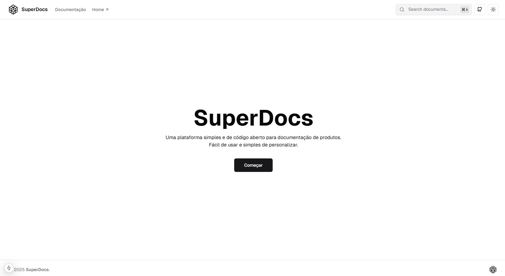
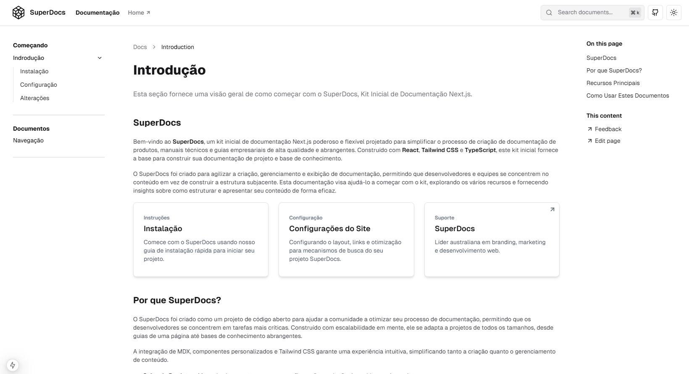

# Documentos

**SuperDocs** é um poderoso kit inicial de documentação em **Next.js** projetado para simplificar o processo de criação de documentação de produtos, manuais técnicos e guias empresariais de alta qualidade. Construído com **React**, **Tailwind CSS** e **TypeScript**, este kit inicial fornece a base para construir a documentação do seu projeto e base de conhecimento.


## Índice

- [Instalação](#installation)
- [Uso](#usage)
- [Funcionalidades](#features)
- [Contribuindo](#contributing)
- [Licença](#license)
- [Contato](#contact)

## Documentação

**(Em Desenvolvimento)**

## Desenvolvimento

### Instalação

1. Clone o repositório:

   ```bash
   git clone https://github.com/danielrocs/superdocs.git
   cd superdocs
   ```

2. Instale as dependências:

   ```bash
   npm install
   ```

3. Execute o servidor de desenvolvimento:

   ```bash
   npm run dev
   ```

4. Abra [http://localhost:3000](http://localhost:3000) no seu navegador para ver o projeto.

5. **Para Produção:**

   - Construa o aplicativo:

     ```bash
     npm run build
     ```

   - Inicie o servidor de produção:

     ```bash
     npm run start
     ```

   - Abra [http://localhost:3000](http://localhost:3000) para ver a versão de produção.

   - **Se estiver implantando na Vercel,** a etapa de build é tratada automaticamente durante a implantação.

## Uso

Este kit pode ser usado para criar documentação de produtos, sites empresariais e guias.


_Tela Principal_


_Tela de Documento_


_Rodapé do Documento_


_Busca de Documentos_


_Tela Principal em Modo Escuro_


_Tela de Documento em Modo Escuro_

## Funcionalidades

### Criação de Conteúdo

- **Integração MDX**: Escreva documentos com Markdown e componentes JSX.
- **Componentes Personalizados**: Reutilize componentes React em seus documentos.
- **Diagramas Mermaid.js**: Crie fluxogramas e diagramas.
- **Matemática e Tabelas**: Inclua tabelas e fórmulas matemáticas LaTeX.

### Navegação e Legibilidade

- **Navegação Multinível**: Páginas aninhadas para hierarquia.
- **Paginação de Conteúdo**: Transições suaves entre páginas.
- **Sumário Dinâmico**: Tabela de conteúdo gerada automaticamente.
- **Alternador de Código**: Alterne e copie trechos de código facilmente.

### Recursos de Código

- **Realce de Sintaxe**: Realce consciente do tema.
- **Blocos de Código Aprimorados**: Destaque de linha e títulos de código.

### Temas e UX

- **Modos Claro/Escuro**: Alternância automática de tema.
- **Otimização SEO**: Metadados gerados automaticamente para melhor classificação.
  - Gerencie meta tags (título, descrição, URLs, compartilhamento social).

### Busca e Melhorias Futuras

- **Busca Avançada**: Busca fuzzy com destaque de termos.
- **Base de Conhecimento IA**: Futuras ferramentas de documentação com IA.

> **Nota:** O suporte à documentação com IA está em desenvolvimento.

## Contribuindo

1. Faça um fork do repositório.
2. Crie um novo branch (`git checkout -b feature-branch`).
3. Faça suas alterações.
4. Commit suas alterações (`git commit -m 'Adiciona alguma funcionalidade'`).
5. Push para o branch (`git push origin feature-branch`).
6. Abra um pull request.

## Licença

Este projeto está licenciado sob a Licença MIT. Veja o arquivo [LICENSE](./LICENSE) para detalhes.
